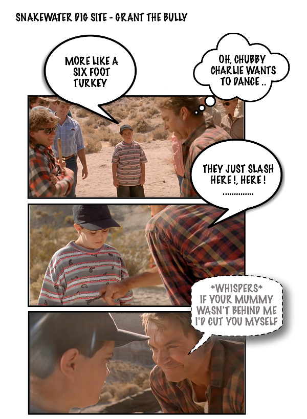
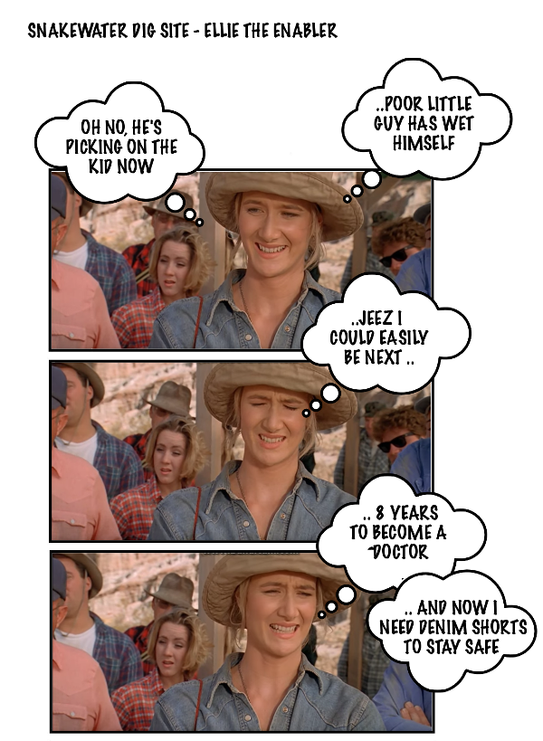
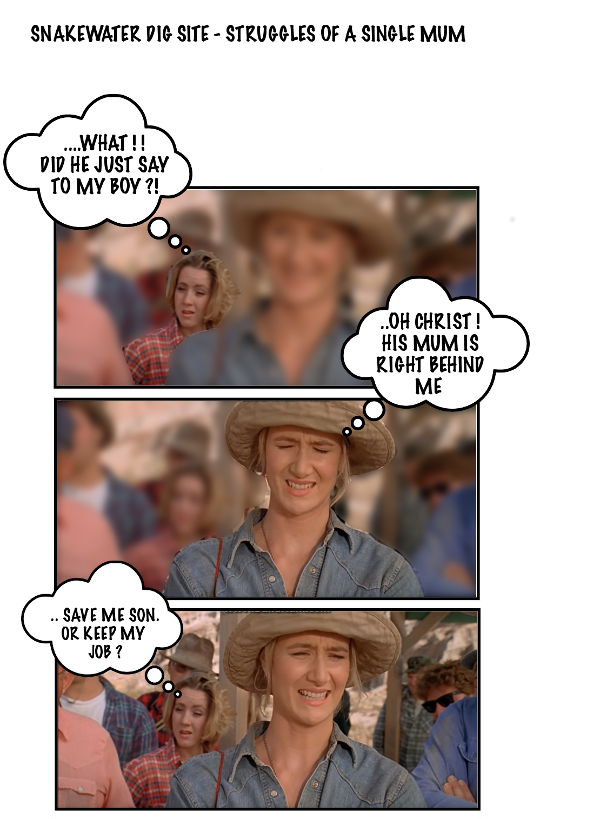
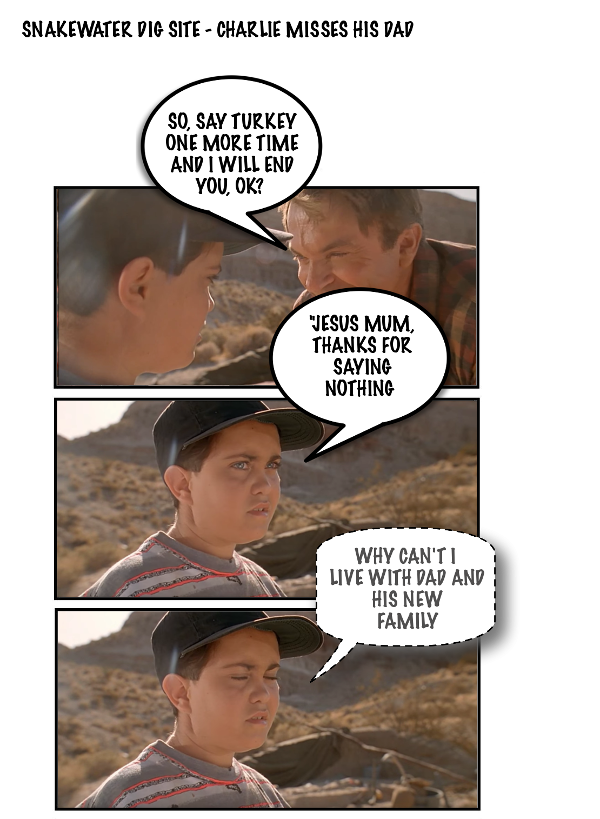
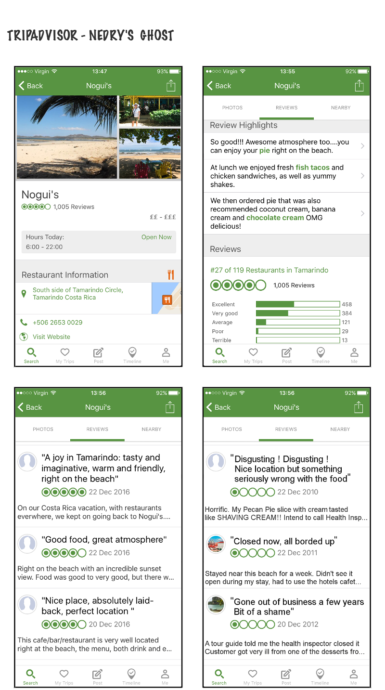

# Hostile Workplace: Badlands, Snakewater Montana

### Picking on a Child

Grants position of power allows his humiliation of a site workers child go unchallenged.

### Ellie fails to Protect the Child

Ellie knows what Grant is doing is wrong but never confronts. Maybe she had her own issues with Grant.

### A Mother Torn

Stand up for Charlie, it's a long walk home if fired from a dig in Snakewater, Montana

### Poor Charlie

Feeling abandoned by his Father, and now let down by his Mother 

### Pie and Shaving Cream

[Dodgson](https://jurassicpark.fandom.com/wiki/Lewis_Dodgson) and [Nedry's](https://jurassicpark.fandom.com/wiki/Dennis_Nedry)
meeting has an unexpected impact on the local tourist industry.

